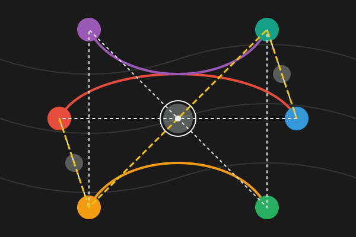
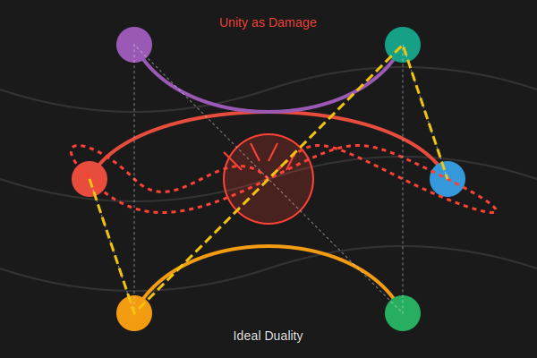

# Visualizations

1. duality and cooperation -  https://claude.site/artifacts/b387e78c-4110-4af3-ba06-a7b10b9e0559
   
2. unity as chaos with duality as structure - https://claude.site/artifacts/04666b9d-6f83-45fd-9187-337053d3caea
   
3. dualism understood - https://claude.site/artifacts/7127da2f-7138-48d2-8c98-6b3b6f83eded
   
4. dualism reality - https://claude.site/artifacts/1cfd92ed-52b2-4416-9e7c-45062639ab3e
   
5. damage beyond ideal - https://claude.site/artifacts/3db33ee4-c20c-42f7-beea-2487b36a2bfd
   
6. temporal balance: chaos to unity - https://claude.site/artifacts/441fbda2-e4cb-4770-b8da-52e493561673
   !(chaos to unity)[chaos_to_unity.svg]
